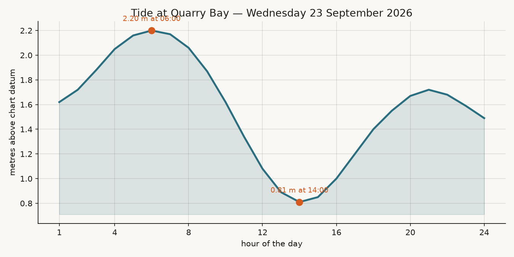
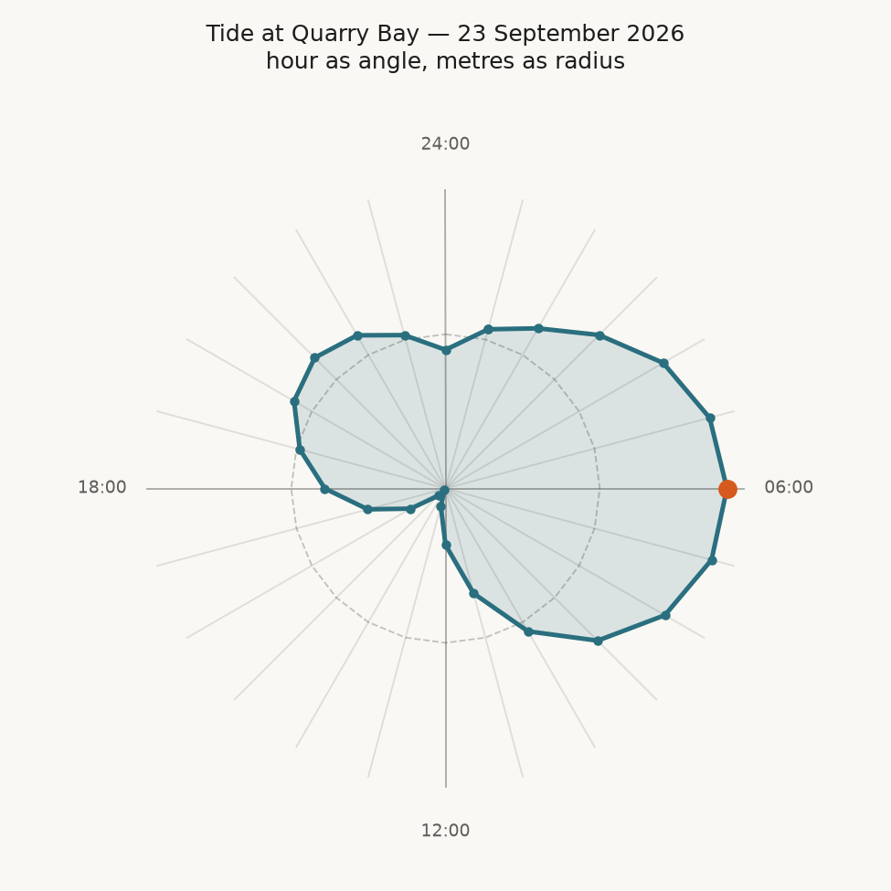
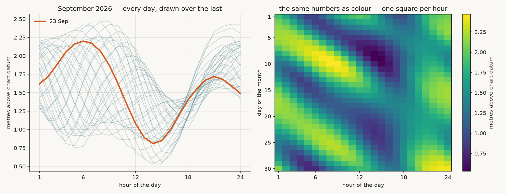
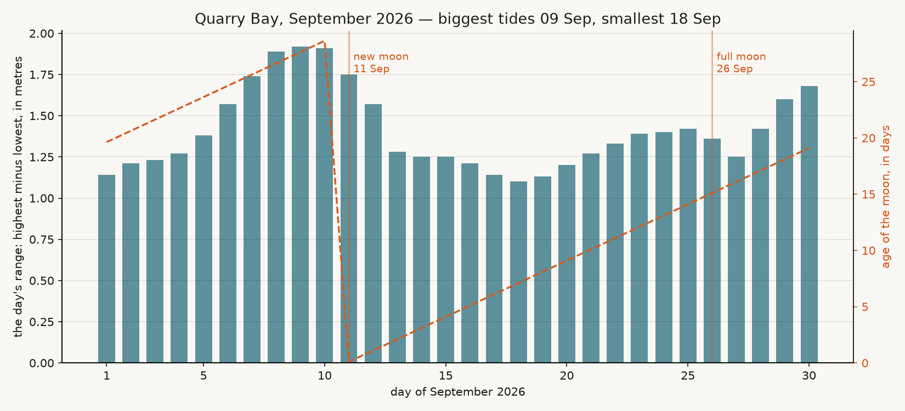
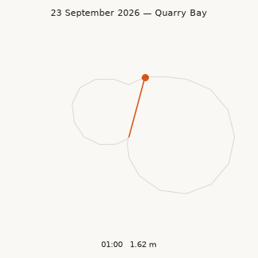
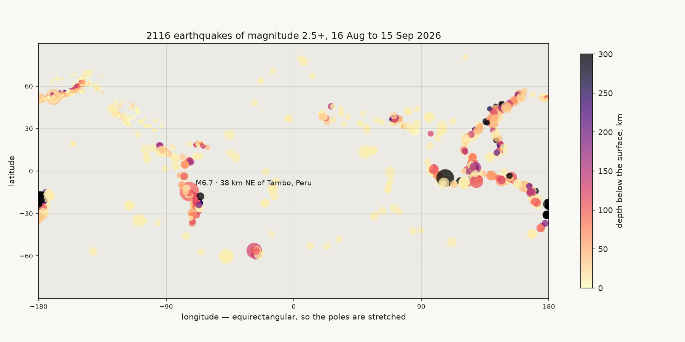
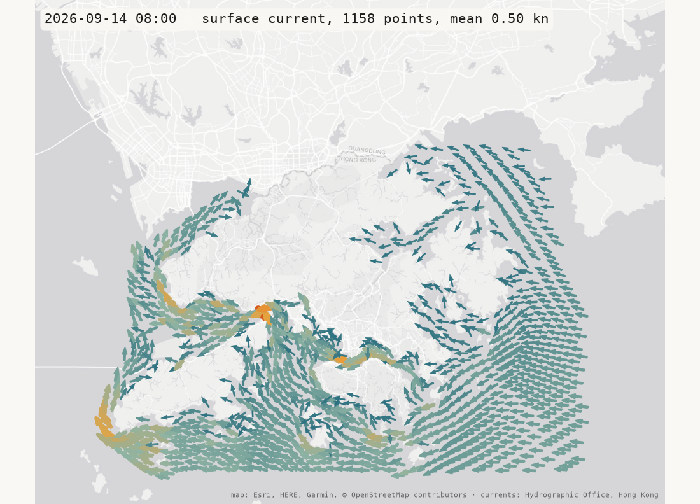
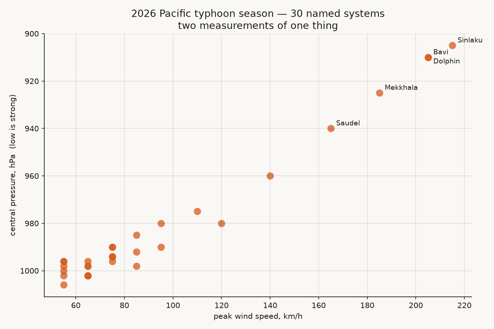

# Week 03 — Numbers into pictures

Two hours. A phenomenon, a file of numbers, and every way to look at them.

The sea outside this building goes up and down. The Observatory measures it and
publishes the answer for every hour of 2026 — 8,760 numbers in a 66 KB file. That
file is in this folder. By the end of the session you will have looked at it six
different ways, and started your own repo doing the same thing to a phenomenon you
picked.

Everything here runs with **no internet**: the raw files are committed under
`data/`. That is not a convenience, it is the rule — *fetch once, keep the file,
parse the file* — and it is the first thing assignment 2 is marked on.

The short drills are in the slides and run in your browser:
<https://sd5913.github.io/teaching/week03/>. This folder is the long version.

```bash
cd pfad          # your clone
git pull         # this folder arrives
cd week03
```

`uv run` had one mention last week and it is every command today. It fetches an
interpreter if there is none, reads the `# /// script` block at the top of the file,
installs what that block names, and runs. Nothing to install first, no `python`, no
`pip`. [`reference/uv.md`](../reference/uv.md) is the ten-minute version.

---

## 0:00 — Twenty-four numbers

```bash
uv run tides.py
```

Twenty-four lines come out. Each is one hour of today at Quarry Bay: the hour, the
height of the water in metres, and a row of `#` as long as the number is big.

```
 1:00  2.19  ######################
 ...
 7:00  1.05  ###########
```

That is a bar chart. No library, no window, nothing installed. Two things made it:

- a **loop** — `for hour, height in enumerate(heights, start=1)`: once for each
  number, with a name that changes each time;
- a **function** — `bar(height)` returns `"#" * round(height * 10)`: one rule,
  applied to every number.

**A loop over the numbers and a function per number is the whole toolkit for
today.** Everything after this is those two with a library drawing instead of
printing.

Open `tides.py` and read three things before you go on:

| Look at | And answer |
|---|---|
| `load_year()` | The file holds `"2.19"`, with quotes. What line turns that into a number, and what happens if you delete it? |
| `bar()` | Change `BAR_SCALE` from `10` to `30`. Predict the picture *before* you run it again. |
| `fetch_year()` | When does this ever run? (Try it: move `data/tides-QUB-2026.json` somewhere else, run again, put it back.) |

`tides.py` is the only file today that reads the tide file. Every other script
starts with `from tides import load_year, day, bar` — **your own file is a library
too**, and this is what that sentence means in practice.

---

## 0:15 — One day, four ways

Four scripts, same twenty-four numbers, four transformations. For each one:
**predict what it draws, run it, then change one knob at the top and predict
again.** The knobs are the first block in every file, with a comment each.

```bash
uv run plot_day.py
uv run tide_clock.py
uv run tide_month.py
uv run moon.py
```

Each writes a PNG into `out/` and opens a window. Close the window to get your
terminal back.

### `plot_day.py` — a line



The text chart with matplotlib doing the drawing. The library is running the same
loop you just read; what you still choose is **which number goes on which axis**.
Knob to try: `FILL = False`.

### `tide_clock.py` — the same day, bent



Hour becomes an angle, height becomes a radius. Nothing about the numbers changed;
one function did:

```python
def to_xy(hour, height):
    angle = math.radians(90 - hour / HOURS * TURN)
    return (height * math.cos(angle), height * math.sin(angle))
```

**A chart type is a transformation.** `move`, `scale` and `rotate` are in the same
file, one line of arithmetic each, and `place()` applies all three to every point.
Knobs to try, in this order: `ROTATE = 90`, then `TURN = 180` (half a day per
turn), then `BASELINE = 0.2` — and say why the shape goes round before you run it.

### `tide_month.py` — thirty days, twice



Left: thirty days drawn on top of each other. Right: the same 720 numbers as a
grid of colour, one square per hour. The left panel buries the month in a thicket
of lines; the right one makes the fortnightly swing between big tides and small
ones impossible to miss. **Neither is more true. They answer different questions.**
Knob to try: `COLOURS = "Blues"`, then `"coolwarm"`.

### `moon.py` — does the moon move the sea?



Before you run it, say which answer you expect: biggest tides at new and full
moon, at half moon, or the same all month.

The tidal **range** of a day is one number made out of twenty-four: highest minus
lowest. The **age of the moon** is one number made out of a date, by arithmetic
and no data at all:

```python
NEW_MOON = dt.date(2000, 1, 6)     # a new moon somebody wrote down
def moon_age(day):
    return (day - NEW_MOON).days % 29.53
```

Then the two go on the same page. The textbook answer is new and full moon. The
sea agrees — *roughly*, and one or two days early, and the full-moon peak is the
weaker of the two. **The roughness is the interesting part. Do not smooth it
away.** A picture that half-confirms a model and tells you where it fails is worth
more than one that confirms it exactly, which usually means you drew the model.

---

## 0:40 — Make it move

```bash
uv run animate.py
```



Twenty-four frames, one per hour, written to `out/tide-clock.gif`. It takes a few
seconds; the terminal tells you the file size when it is done.

**A frame is a function of time.** `frame(i)` draws the first `i` hours and puts
the hand at hour `i`; `FuncAnimation` calls it once per frame and hands each one to
a writer. `to_xy` is imported from `tide_clock.py` — written once, used twice.

Knobs: `TRAIL = False` (predict it first), `FPS`, `DPI`. Raise `DPI` and watch the
file size; a GIF you cannot put in a README is not a deliverable.

---

## 0:55 — Three numbers at once

```bash
uv run earthquakes.py
uv run earthquakes.py --day
```



Every earthquake on Earth of magnitude 2.5 and up, for a month: 2,116 of them, from
the USGS. Position on the page from longitude and latitude, size from magnitude,
colour from depth — **four numbers in one dot**.

Nobody drew a coastline. The dots *are* the plate boundaries.

`--day` plays the month back, one frame per day, into `out/quakes-month.gif`.

Three things in this script that will be in your assignment:

- **The raw file goes in `data/` and stays there.** 1.5 MB of GeoJSON, exactly as
  the USGS sent it. Delete it and the next run fetches it again, once.
- **Trimming is work.** `save_csv()` turns those 1.5 MB into five columns in
  `out/quakes.csv`. Open it. That is the data you actually used.
- **The map is a decision.** Longitude straight across, latitude straight up —
  equirectangular. Greenland comes out enormous. Every flat map of a round planet
  is wrong somewhere; choosing where is your job, and saying so in your README is
  the difference between a chart and a claim.

Knob to try: `MIN_MAG = 4.5`, and watch how much of the picture was small tremors
in Alaska and California.

### The week 2 arrows, back where they were measured — for five days

```bash
uv run currents.py            # out/currents.webp — arrows, one frame per hour, 120 hours
uv run currents.py --drift    # out/currents-drift.webp — specks of water carried along
```



Week 2 had one afternoon of tidal streams and drew it as rings, the positions
thrown away. `fetch.py` asks the Hydrographic Office for **five days, hour by
hour** — 120 replies, one every half second so as not to hammer their server —
and writes the five columns that matter to `data/tidal-streams-2026-09-14-to-18.csv`:
138,960 rows, 7 MB. That file is committed, so you do not need to run `fetch.py`
unless you want a different week.

Every arrow goes back to the place in the sea it describes, on top of a real
map, and the 120 hours become 120 frames: about ten tidal cycles in ten seconds.
Watch the whole sea reverse twice a day.

**Three transformations, three functions, and you have read all of them today:**

- `to_xy(knot, deg)` — a compass bearing into an (east, north) vector. The same
  function as the tide clock, with north where 12 o'clock was.
- `to_pixel(lng, lat)` — the round Earth onto the flat tile grid every web map
  uses. Twelve lines, and it is the whole reason the arrows land on Esri's tiles
  instead of somewhere near them. `earthquakes.py` skipped this; here it matters.
- `frame(i)` — one hour into one picture. The loop over `i` is the film.

`--drift` is the artist's path on the same numbers: 2,500 specks of water, each
one moved every frame by whichever arrow is nearest, leaving a short trail. Nobody
drew the stream lines. They are where the water goes. Read `nearest()` — it is
a loop over nine cells of a grid, which is how you find the closest of 1,158
things 2,500 times a frame without doing 2,500 × 1,158 distances.

The films are animated **WebP**, not GIF: the same 120 frames were 10 MB as a
GIF and are 3 MB as WebP, and GitHub plays both in a README. The map tiles are
fetched once and stitched into `data/basemap-*.png`, so this, too, runs with the
wifi off. That is the third `data/` file in this folder that came from somewhere
else, and each one says where in the code.

**This is what an assignment 2 repo looks like** — one published file of numbers,
one picture that could not be drawn by hand, and every step written down. Yours
does not need a map. It needs the three things.

**A design decision, made visible.** Every arrow is the same length; speed is
its thickness and its colour. That is `ARROW_STYLE = "weight"`. The classic vector
plot — speed as length too — is `ARROW_STYLE = "length"`, one word away, and it is
worth running both: the long arrows in the fast channels pile over each other and
the picture reads as clutter where it should read as force. Same numbers, one
knob, a different claim. `uv run currents.py --still` draws only the PNG, which is
the quick way to try it.

Knobs: `ARROW_STYLE`, `FPS` (how fast the five days go by), `STILL` (which hour
the PNG shows), `SPEEDUP` (how far the water gets per frame in `--drift`),
`TRAIL`, `ZOOM = 12` for a sharper map (four times the tiles, one fetch). In `fetch.py`: `DATE`, `SLOTS`, `STEP_MINUTES` — every 15 minutes is
what the office publishes; every 60 is what keeps the file at 7 MB.

### The same arrows as a web page

```bash
uv run currents_web.py        # writes site/index.html — open it in a browser
```

No window, no PNG. Python writes one HTML file and stops; the browser does the
drawing. `folium` is a Python library that generates the JavaScript for
[Leaflet](https://leafletjs.com/), the map library under most maps on the web.
The page you get pans, zooms, and has a play button: the 120 hours are a time
slider, every arrow is a line between two points on the Earth, and the
projection that `currents.py` wrote by hand in `to_pixel()` is done by Leaflet.

Open `site/index.html` in a browser. That is the whole test — if it plays on your
machine it will play on anybody's, because the file carries everything except the
map tiles. `site/` is not committed: it is output, and it is 7 MB.

**This is the version that can be published.** A script that writes a web page is
exactly the shape GitHub Pages wants — see step 8 below, and
[`assignments/pages.yml`](../assignments/pages.yml). Test it locally, push, and
GitHub builds the same page on its own machine and puts it on a URL. It has been
done: [`sd5913/tidal-streams`](https://github.com/sd5913/tidal-streams) is these
two scripts as a finished assignment 2 repo, and its page is live at
<https://sd5913.github.io/tidal-streams/>. Read its README and PROCESS.md before
you write yours.

Knobs: `MIN_KNOT` and `THIN` decide how many arrows make it onto the page — the
slow open sea is left out, or the file would be 25 MB and the browser would crawl;
`ARROW_MINUTES` for how far each arrow reaches, `PLAY_MS` for the speed of the film.

---

## 1:10 — Same idea, messier

```bash
uv run typhoons.py
```



Nobody publishes this year's typhoons as JSON. It is a table on a Wikipedia page,
written by people, for people. A page is a **tree**; BeautifulSoup walks it;
`select("table.wikitable.sortable tr")` gets the rows. Then every cell is text and
you go in after the number:

```python
number("215 km/h (130 mph)", "km/h")   # -> 215.0
```

Read the terminal as well as the picture. Five rows were skipped and it says which,
and why — unnamed depressions with no wind speed recorded. **Not every row of a
table is data**, and a table has a footer that will happily arrive dressed as a
storm called *35 systems* if you do not stop at it.

The points fall on a curve, because peak wind and central pressure are two
measurements of one thing. A scatter plot that shows a physical law is not
decoration.

Being polite when you scrape, all of it in this file: one request, a `User-Agent`
that says who you are, and the reply saved to `data/` so you never ask twice.

---